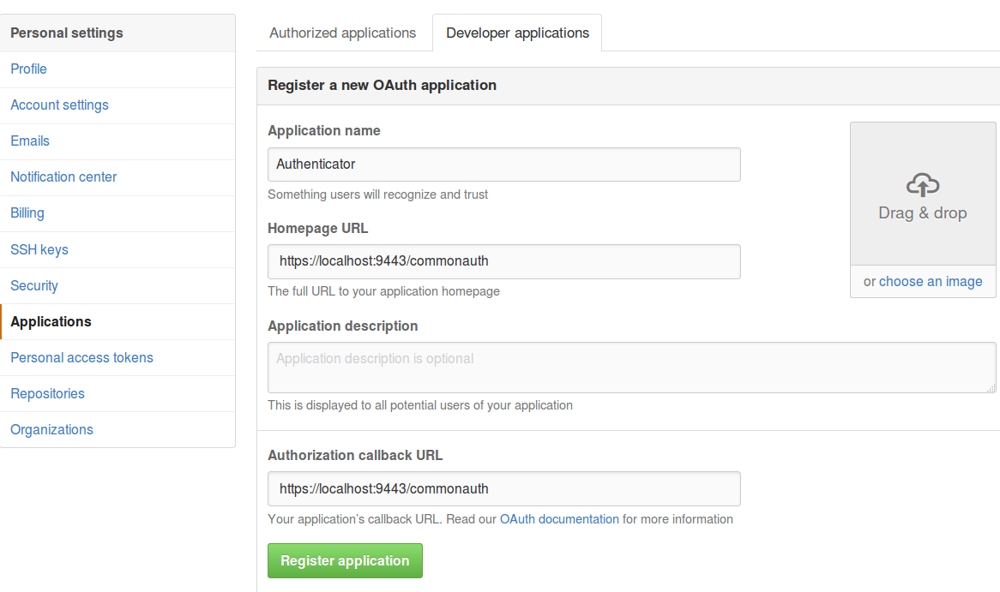
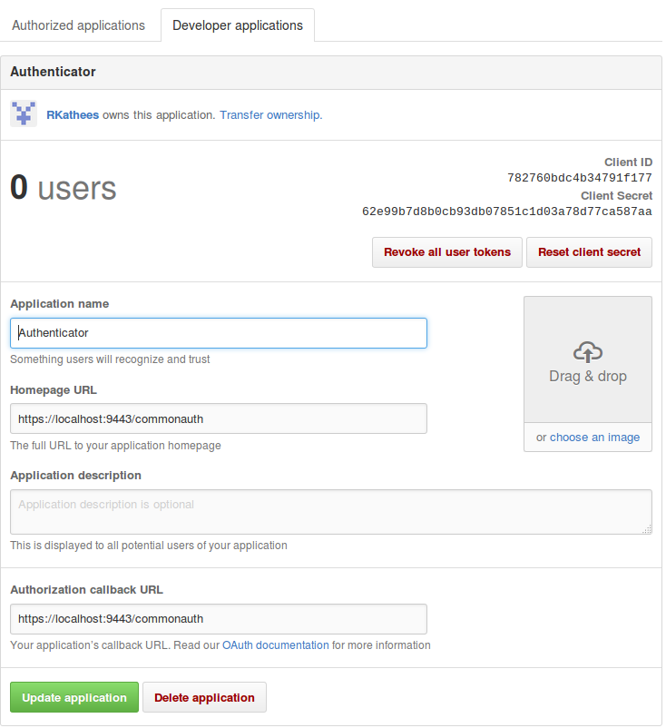
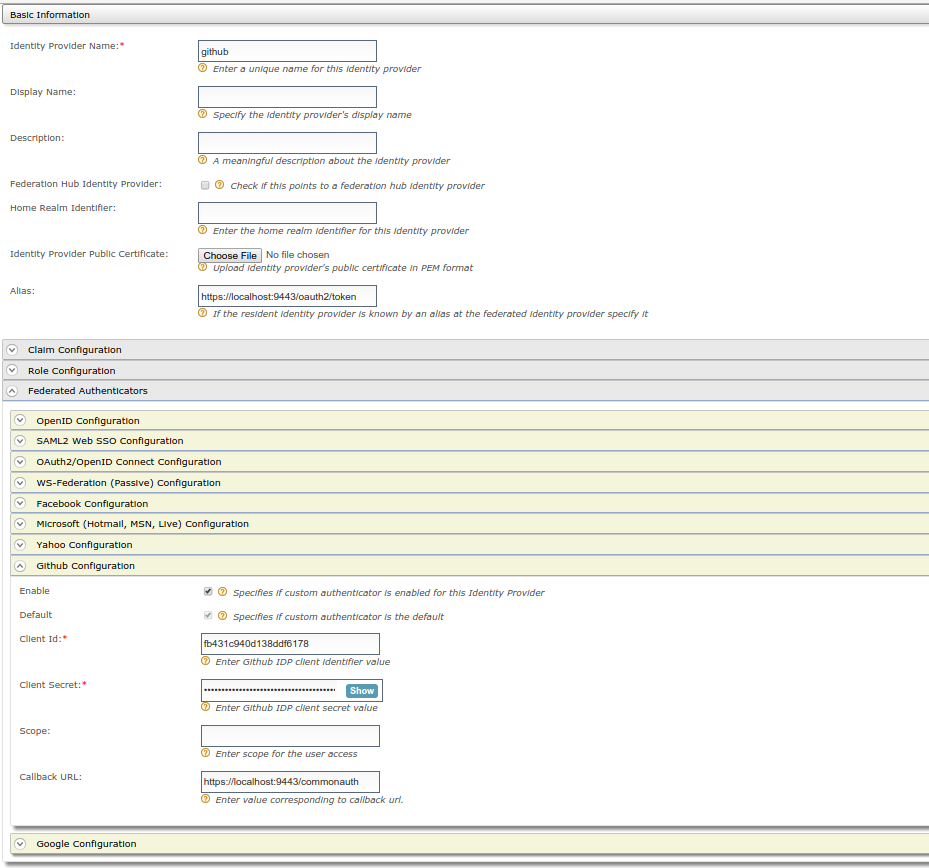
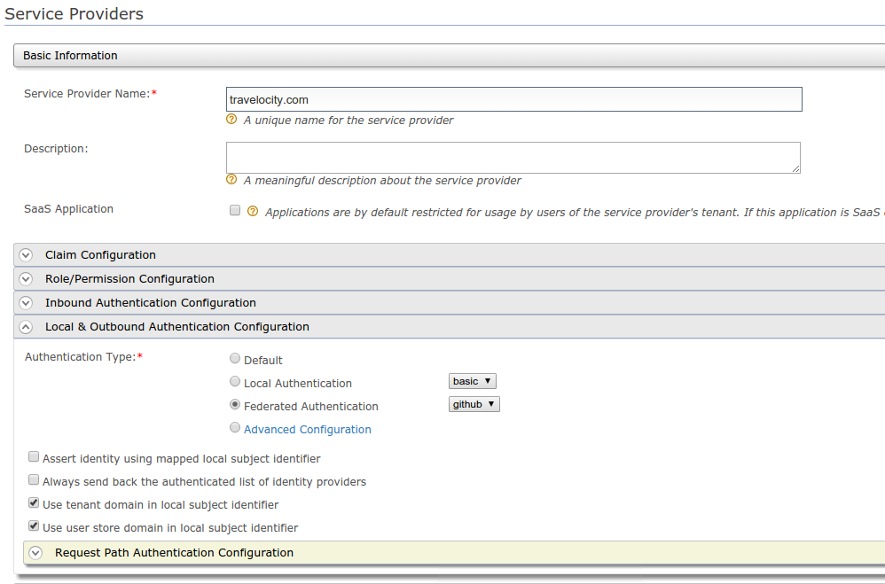

# Github Authenticator

The Github authenticator allows you to authenticate a user using Github through the WSO2 Identity Server. Github is a web-based hosting service for software development projects that facilitates powerful collaboration, code review, and code management for open source and private software development projects.

This page provides instructions on how to configure the Github authenticator and Identity Server using a sample app. You can find more information in the following sections.

```
Github Authenticator is supported by Identity Server 5.1.0 upwards.
```

* [Deploying Github artifacts](#Deploying-Github-artifacts)

* [Configuring the Github App](#Configuring-the-Github-App)

* [Deploying travelocity.com sample app](#Deploying-travelocity.com-sample-app)

* [Configuring the identity provider](#Configuring-the-identity-provider)

* [Configuring the service provider](Configuring the service provider)

* [Testing the sample](#Testing-the-sample)

## Deploying Github artifacts

* Either Download the artifacts for this authenticator from [the store](https://store.wso2.com/store/assets/isconnector/details/bfed96a9-0d79-4770-9c55-22378d3a2812) or [build the project](Building From the Source) to get the jar and by adding it in the <IS-Home>/repository/components/dropins directory.

* If you want to upgrade the Github Authenticator (.jar) in your existing IS pack, follow the bellow instructions.
  * Stop WSO2 Identity Server if the server is already running.
  * Download and extract the latest version of the connector artifacts (.jar, .war, gadgets etc.,) from the connector store.
  * Replace the old .jar file found in the <IS_HOME>/repository/components/dropins folder with the new .jar file that you downloaded.

## Building From the Source

Follow the steps given below to build the Salesforce EI Inbound Endpoint from the source code:

1. Get a clone or download the source from [Github](https://github.com/wso2-extensions/identity-outbound-auth-github).
2. Run the following maven command from the `identity-outbound-auth-github` directory: `mvn clean install`.
3. org.wso2.carbon.identity.authenticator.github-x.x.x.jar file is created in the `identity-outbound-auth-github/component/target` directory.

## Configuring the Github App

1. GO to [Github](https://www.github.com/) and create a github account.
2. Register your app at [here](https://github.com/settings/applications/new).
    
3. Use https://localhost:9443/commonauth as the authorization callback URL when you register the client.
4. Now you can get the clientId and clientSecret of your created app.


## Deploying travelocity.com sample app

Follow the steps below to deploy the travelocity.com sample application:

### Download the samples

To be able to deploy a sample of Identity Server, you need to download it onto your machine first. 

Follow the instructions below to download a sample from GitHub.

* Create a folder in your local machine and navigate to it using your command line.

* Run the following commands.
  ```
  mkdir is-samples
  cd is-samples/
  git init
  git remote add -f origin https://github.com/wso2/product-is.git
  git config core.sparseCheckout true
  ```
  
* Navigate into the .git/info/ directory and list out the folders/files you want to check out using the echo command below.
    ``` 
    cd .git
    cd info
    echo "modules/samples/" >> sparse-checkout
    ```
    
* Navigate out of .git/info directory and checkout the v5.4.0 tag to update the empty repository with the remote one.
    ```
    cd ..
    cd ..
    git checkout -b v5.4.0 v5.4.0
    ```
* Go to is-samples/modules/samples/sso/sso-agent-sample directory and run `mvn clean install` and get the war file from the target folder.

### Deploy the sample web app

Deploy this sample web app on a web container.

1. Use the Apache Tomcat server to do this. If you have not downloaded Apache Tomcat already, download it from [here](https://tomcat.apache.org/download-70.cgi).

2. Copy the .war file into the  webapps  folder. For example,  <TOMCAT_HOME>/apache-tomcat-<version>/webapps .

3. Start the Tomcat server. 

    To check the sample application, navigate to http://<TOMCAT_HOST>:<TOMCAT_PORT>/travelocity.com/index.jsp on your browser.
    For example, `http://localhost:8080/travelocity.com/index.jsp.`
    ```
    Note: It is recommended that you use a hostname that is not localhost to avoid browser errors. Modify the /etc/hosts entry in your machine to reflect this. Note that localhost is used throughout thisdocumentation as an example, but you must modify this when configuring these authenticators or connectors with this sample application.
    ```
    
Once this is done, the next step is to configure the WSO2 Identity Server by adding an identity provider and service provider.

## Configuring the identity provider

Now you have to configure WSO2 Identity Server by [adding a new identity provider](https://docs.wso2.com/display/IS570/Adding+and+Configuring+an+Identity+Provider).

* Download the WSO2 Identity Server from [here](http://wso2.com/products/identity-server/).

* Run the [WSO2 Identity Server](https://docs.wso2.com/display/IS570/Running+the+Product).

* Log in to the [management console](https://docs.wso2.com/display/IS570/Getting+Started+with+the+Management+Console) as an administrator.

* In the `Identity Providers` section under the `Main` tab of the management console, click `Add`.

* Give a suitable name for `Identity Provider Name`.


* Navigate to `Github Configuration` under `Federated Authenticators`. 

* Enter the values as given in the above figure.
   * Client Id: Client Id for your app.
   * Client Secret: Client Secret for your app.
   * Scope: Scope of the authorize token. For information on available scopes, see Scopes.
   * Callback URL: Service Provider's URL where code needs to be sent .
* Select both checkboxes to `Enable` the Github authenticator and make it the `Default`.

|   Property    |   Description    |   Sample value    |
|   ---  |   --- |   ---    |
|   Scope | Scope of the authorize token. For information on available scopes, see [Scopes](https://developer.github.com/apps/building-oauth-apps/understanding-scopes-for-oauth-apps/).    |   |
|   Enable  |   Selecting this option enables github to be used as an authenticator for users provisioned to the Identity Server.   | Selected  |
|   Default |   Selecting the Default checkbox signifies that github is the main/default form of authentication. This removes the selection made for any other Default checkboxes for other authenticators. |   Selected    |
|   ClientID    |   This is the username from the github application    |   	8437ce9b8cfdf282c92b    |
|   Client Secret   |   This is the password from the github application. Click the Show button to view the value you enter.    |   7219bb5e92f4287cb5134b73760e039e55d235d |
|   Callback URL    |   This is the URL to which the browser should be redirected after the authentication is successful. The URL should be specified in the following format: https://<HOST_NAME>:<PORT>/acs   |   https://localhost:9443/commonauth   |


* Click `Register`.

You have now added the identity provider.

## Configuring the service provider

The next step is to configure the service provider.

1. Return to the management console.

2. In the `Service Providers` section, click `Add` under the `Main` tab.

3. Since you are using travelocity as the sample, enter travelocity.com in the `Service Provider Name` text box and click `Register` .

4. In the `Inbound Authentication Configuration` section, click `Configure` under the `SAML2 Web SSO Configuration` section.

5. Now set the configuration as follows:
    1. Issuer: travelocity.com
    2. Assertion Consumer URL: http://localhost:8080/travelocity.com/home.jsp
    
6. Select the following check-boxes:
    1. Enable Response Signing.
    2. Enable Single Logout. 
    3. Enable Attribute Profile.
    4. Include Attributes in the Response Always.

   
   
7. Click `Update` to save the changes. Now you will be sent back to the `Service Providers` page.

8. Navigate to the Local and `Outbound Authentication Configuration` section.
 
9. Select the identity provider you created from the drop-down list under `Federated Authentication`.


10. Ensure that the `Federated Authentication` radio button is selected and click  `Update` to save the changes. 

You have now added and configured the service provider.

## Testing the sample

1. To test the sample, go to the following URL: http://<TOMCAT_HOST>:<TOMCAT_PORT>/travelocity.com/index.jsp. E.g., http://localhost:8080/travelocity.com

2. Login with SAML from the WSO2 Identity Server.


    If you checkout from tag v5.7.0 when you downloading the sample then login with SAML(Redirect binding).
    

3. Enter your Github credentials in the prompted login page of Github. Once you log in successfully you will be taken to the home page of the travelocity.com app. Also the information added in the [public profile](https://github.com/settings/profile) in Github, can see in the home page of the travelocity.com app.

Also you can see, user is added in to the [application you created](https://github.com/settings/applications/) in the Github.
